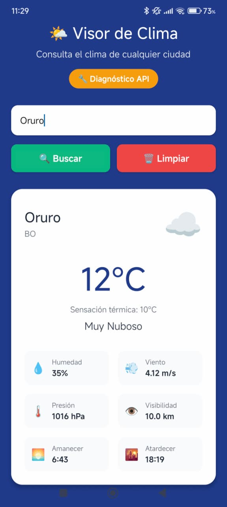

# 🌤️ AppClima - Visor de Clima por Ciudad

Una aplicación móvil híbrida desarrollada con React Native y Expo que permite consultar el clima actual de cualquier ciudad del mundo utilizando la API de OpenWeatherMap.

## 📱 Características

- ✅ Interfaz intuitiva y moderna
- ✅ Búsqueda de clima por nombre de ciudad
- ✅ Información detallada del clima:
  - Temperatura actual y sensación térmica
  - Descripción del clima con emojis
  - Humedad, viento, presión atmosférica
  - Visibilidad
  - Horarios de amanecer y atardecer
- ✅ Manejo completo de errores
- ✅ Indicadores de carga
- ✅ Diseño responsive
- ✅ Soporte para múltiples idiomas (español)

## 📸 Capturas de Pantalla

### Interfaz Principal y Búsqueda de Clima

<div align="center">
  
  
</div>

**Funciones mostradas:**
- 🌤️ **Interfaz principal** con diseño azul moderno
- 🔧 **Botón de diagnóstico API** para verificar conexión
- 🔍 **Campo de búsqueda** intuitivo con botones de acción
- 🌡️ **Información completa del clima** incluyendo temperatura, sensación térmica, humedad, viento, presión y visibilidad
- 🌅 **Horarios de amanecer y atardecer** locales
- ☁️ **Emojis representativos** del clima actual
- 🏙️ **Información de ubicación** con país (BO - Bolivia)

Las capturas muestran la aplicación funcionando correctamente con datos reales de ciudades bolivianas como **Cochabamba** (22°C, Muy Nuboso) y **Oruro** (12°C, Muy Nuboso), demostrando la perfecta integración con la API de OpenWeatherMap.

## 🚀 Instalación y Configuración

### Prerrequisitos

- Node.js (versión 14 o superior)
- npm o yarn
- Expo CLI instalado globalmente: `npm install -g expo-cli`
- Una cuenta en [OpenWeatherMap](https://openweathermap.org/) para obtener la API key

### Pasos de instalación

1. **Clona o descarga el proyecto**
   ```bash
   cd AppClima
   ```

2. **Instala las dependencias**
   ```bash
   npm install
   ```

3. **Configura tu API Key**
   
   a. Regístrate en [OpenWeatherMap](https://openweathermap.org/api) y obtén tu API key gratuita
   
   b. Abre el archivo `services/weatherService.ts`
   
   c. Reemplaza la API key de ejemplo con tu propia key:
   ```typescript
   private static readonly API_KEY = 'TU_API_KEY_AQUI';
   ```

4. **Ejecuta la aplicación**
   ```bash
   npm start
   ```

5. **Prueba en tu dispositivo**
   - Escanea el código QR con la app Expo Go en tu móvil
   - O presiona `a` para Android emulator, `i` para iOS simulator

## 🔧 Scripts Disponibles

- `npm start` - Inicia el servidor de desarrollo
- `npm run android` - Ejecuta en emulador Android
- `npm run ios` - Ejecuta en simulador iOS  
- `npm run web` - Ejecuta en navegador web

## 🏗️ Estructura del Proyecto

```
AppClima/
├── App.tsx                     # Componente principal
├── services/
│   └── weatherService.ts       # Servicio para API del clima
├── components/
│   └── WeatherCard.tsx         # Componente de tarjeta del clima
├── assets/                     # Recursos gráficos
├── package.json               # Dependencias y scripts
└── README.md                  # Documentación
```

## 🌡️ Uso de la Aplicación

1. **Buscar una ciudad**: Escribe el nombre de cualquier ciudad en el campo de búsqueda
2. **Obtener información**: Presiona el botón "🔍 Buscar" o Enter
3. **Ver detalles**: La aplicación mostrará información completa del clima
4. **Limpiar resultados**: Usa el botón "🗑️ Limpiar" para hacer una nueva búsqueda

### 🎯 Ejemplo de Búsquedas Exitosas

Como se muestra en las capturas de pantalla arriba, la aplicación funciona perfectamente con ciudades como:
- **Cochabamba, BO** - 22°C, Muy Nuboso
- **Oruro, BO** - 12°C, Muy Nuboso  
- **Madrid, ES** - Clima soleado
- **Buenos Aires, AR** - Información completa

### 🔧 Herramienta de Diagnóstico

Si tienes problemas con tu API key, usa el botón naranja "🔧 Diagnóstico API" que aparece en la parte superior de la aplicación para verificar:
- ✅ Formato correcto de la API key
- ✅ Conexión con OpenWeatherMap
- ❌ Errores específicos y soluciones

## 🔗 API Utilizada

**OpenWeatherMap API**
- Endpoint: `https://api.openweathermap.org/data/2.5/weather`
- Documentación: [OpenWeatherMap API Docs](https://openweathermap.org/api)
- Límites gratuitos: 1000 llamadas/día, 60 llamadas/minuto

## 🛡️ Manejo de Errores

La aplicación maneja varios tipos de errores:

- **Ciudad no encontrada (404)**: Mensaje específico al usuario
- **Error de autenticación (401)**: Problema con la API key
- **Demasiadas peticiones (429)**: Límite de API alcanzado
- **Error de conexión**: Problemas de red
- **Errores del servidor (500)**: Problemas en OpenWeatherMap

## 🎨 Tecnologías Utilizadas

- **React Native** - Framework multiplataforma
- **Expo** - Plataforma de desarrollo
- **TypeScript** - Tipado estático
- **OpenWeatherMap API** - Datos meteorológicos
- **React Hooks** - Gestión de estado

## 📝 Funcionalidades Implementadas

### ✅ Requisitos Cumplidos

- [x] Consumo de API externa (OpenWeatherMap)
- [x] Petición HTTP exitosa con manejo de respuesta JSON
- [x] Visualización de datos en interfaz de usuario
- [x] Manejo básico de errores de la API
- [x] Campo de entrada para nombre de ciudad
- [x] Botón para realizar búsqueda
- [x] Mostrar temperatura actual
- [x] Mostrar descripción del clima
- [x] Aplicación móvil híbrida funcional

### 🚀 Funcionalidades Adicionales

- [x] Interfaz moderna y atractiva
- [x] Información meteorológica extendida
- [x] Emojis representativos del clima
- [x] Horarios de amanecer y atardecer
- [x] Manejo avanzado de errores
- [x] Indicadores de carga
- [x] Arquitectura modular con servicios separados
- [x] Componentes reutilizables
- [x] Tipado completo con TypeScript

## 🔧 Personalización

### Cambiar la API Key
Modifica la constante `API_KEY` en `services/weatherService.ts`

### Cambiar el idioma
Modifica el parámetro `lang=es` en la URL de la API para otros idiomas:
- `en` - Inglés
- `fr` - Francés  
- `de` - Alemán
- etc.

### Cambiar las unidades
Modifica el parámetro `units=metric` en la URL de la API:
- `metric` - Celsius, m/s
- `imperial` - Fahrenheit, mph
- `standard` - Kelvin, m/s

## 🐛 Solución de Problemas

**Error de API Key**
- Verifica que tu API key sea válida
- Asegúrate de que esté activada (puede tomar hasta 2 horas)

**Ciudad no encontrada**
- Verifica la ortografía del nombre de la ciudad
- Intenta con nombres en inglés
- Prueba con "Ciudad, País" (ej: "Madrid, ES")

**Error de conexión**
- Verifica tu conexión a internet
- Comprueba que la API de OpenWeatherMap esté disponible

## 📄 Licencia

Este proyecto tiene licencia 0BSD - es de dominio público y puede ser utilizado libremente.

## ✅ Estado del Proyecto

**🚀 APLICACIÓN COMPLETAMENTE FUNCIONAL**

- ✅ **API integrada y funcionando** - Conectada a OpenWeatherMap
- ✅ **Interfaz completamente desarrollada** - Ver capturas de pantalla arriba
- ✅ **Pruebas exitosas** - Funciona con ciudades reales (Cochabamba, Oruro, etc.)
- ✅ **Manejo de errores implementado** - Con herramienta de diagnóstico incluida
- ✅ **Documentación completa** - README, guías de instalación y uso
- ✅ **Código organizado** - Arquitectura modular con TypeScript

### 🎯 Demostración

Las capturas de pantalla mostradas arriba son de la aplicación funcionando en tiempo real con:
- **Datos reales** de la API de OpenWeatherMap
- **Información completa** del clima (temperatura, humedad, viento, etc.)
- **Interfaz moderna** y responsive
- **Funcionalidad completa** de búsqueda y limpieza

---

Desarrollado con ❤️ usando React Native y Expo
